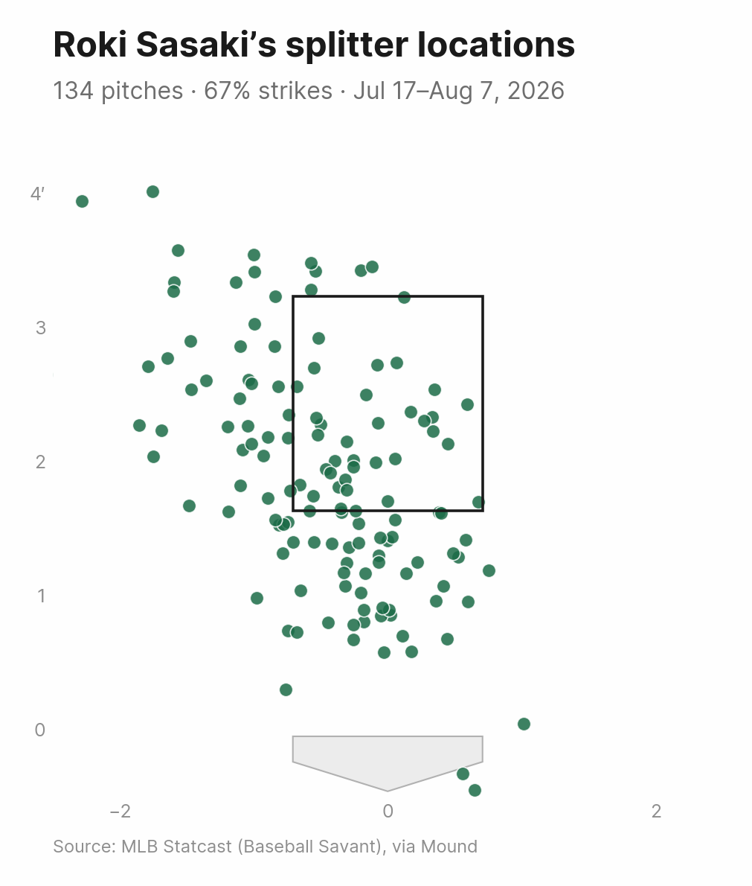
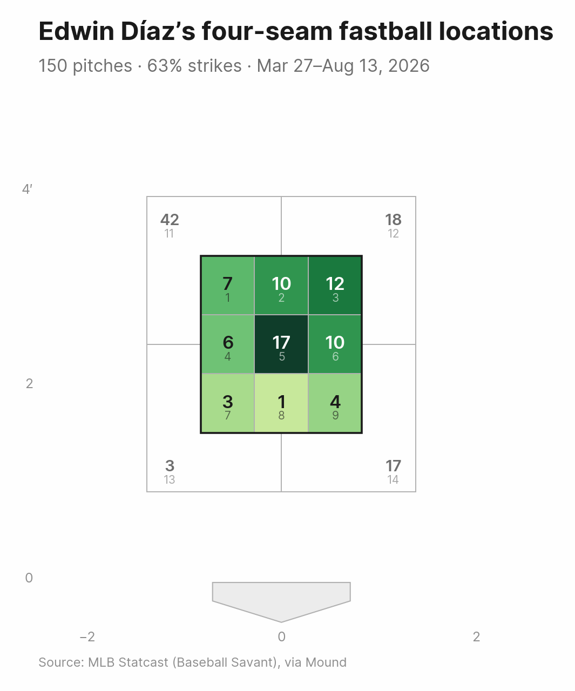
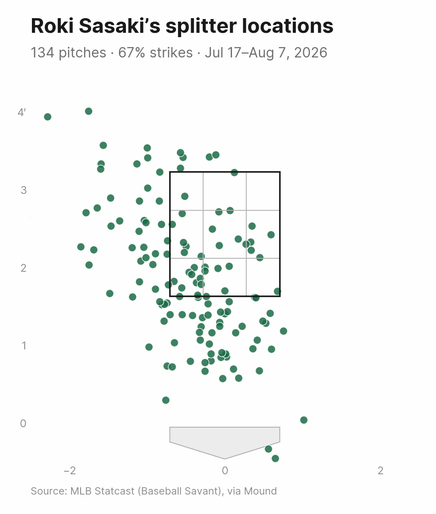
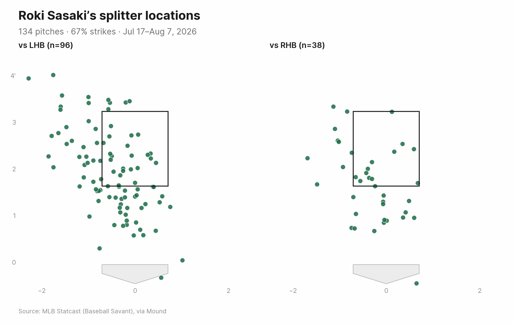
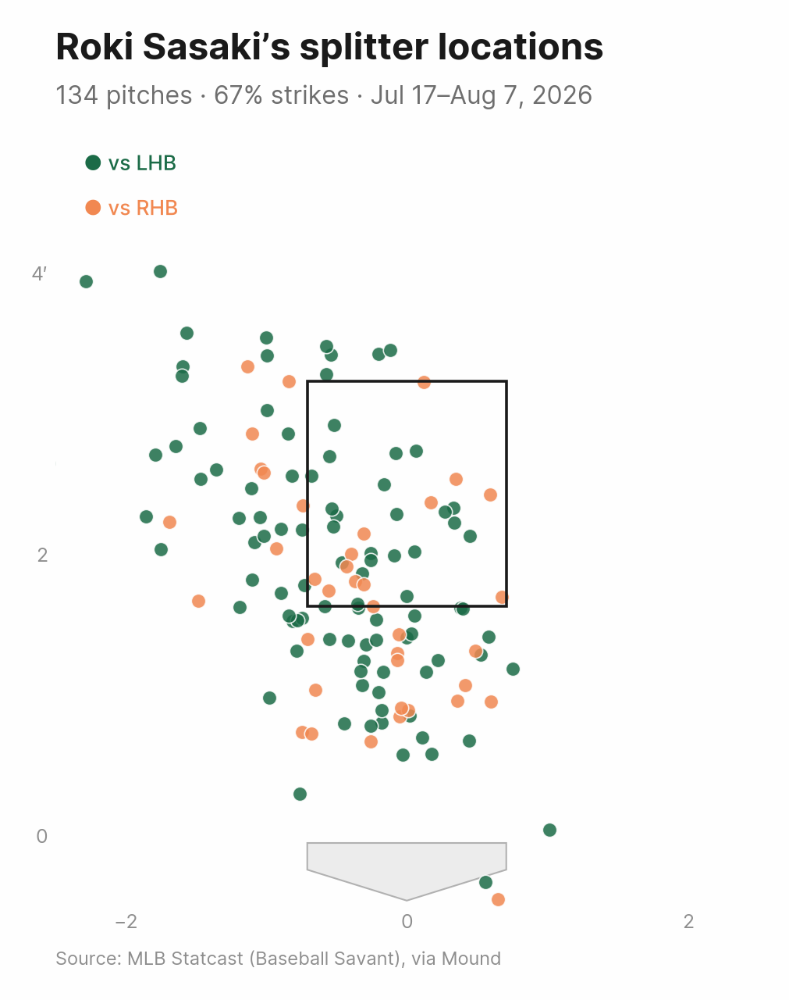
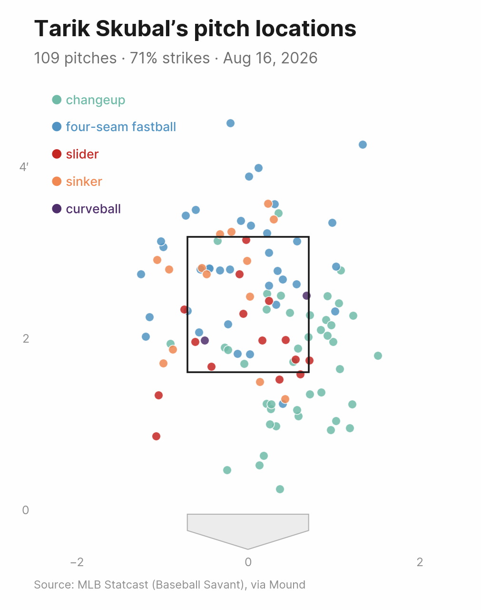

# Mound

A CLI and Python toolkit for retrieving, analyzing and visualizing MLB pitch-level data — without needing to know MLB player IDs or the underlying API structures.

```
> How many splitters did Roki Sasaki throw against the Diamondbacks last night?
> How often has he thrown it relative to his other pitches over his last four starts?
> What does its location look like over that period?
> How does he attack one particular hitter, and does that hitter chase the splitter?
```

Mound answers questions like these with a few CLI commands or a few lines of Python.

## Contents

- [Get started](#get-started)
  - [Install](#install)
  - [Quickstart](#quickstart)
- [Concepts](#concepts)
  - [`is_strike` vs. `in_zone`](#is_strike-vs-in_zone)
  - [Zones](#zones)
  - [At-bat outcomes](#at-bat-outcomes)
  - [Pitch types](#pitch-types)
- [Working with pitches](#working-with-pitches)
  - [Games](#games)
  - [Matchups](#matchups)
  - [Whiff rate, chase rate and pitch metrics](#whiff-rate-chase-rate-and-pitch-metrics)
  - [Plots](#plots)
- [Utilities](#utilities)
  - [Caching](#caching)
  - [Video downloads](#video-downloads)
- [Project](#project)
  - [Examples](#examples)
  - [Data sources](#data-sources)
  - [Known limitations](#known-limitations)
- [Development](#development)
- [Roadmap](#roadmap)
- [Changelog](#changelog)

## Get started

### Install

```bash
pip install mound

# Parquet export support:
pip install "mound[parquet]"

# KDE heatmaps (kind="kde"):
pip install "mound[viz]"
```

Or from a local checkout (editable):

```bash
git clone https://github.com/stiles/mound.git
cd mound
pip install -e .
```

Requires Python 3.10+.

### Quickstart

#### CLI

```bash
# Find a player and their MLB ID
mound search "Roki Sasaki"

# List his games -- date, opponent, home/away, game_pk -- without
# fetching a single pitch (last N appearances, or a whole season)
mound games "Roki Sasaki" --last 4
mound games "Roki Sasaki" --season 2026

# Retrieve pitches from his last 4 starts, or a whole season
mound pitches "Roki Sasaki" --last 4
mound pitches "Roki Sasaki" --season 2026

# Isolate one pitch type
mound pitches "Roki Sasaki" --last 4 --pitch splitter

# Pitch mix and results by pitch type
mound mix "Roki Sasaki" --last 4
mound results "Roki Sasaki" --last 4 --pitch splitter

# Velocity, spin, movement, whiff and chase rate, side by side
mound arsenal "Roki Sasaki" --game 825051

# Narrow any command to one opposing batter for a matchup view
mound results "Roki Sasaki" --last 4 --batter "Geraldo Perdomo"

# Plot pitch locations against the strike zone
mound zone "Roki Sasaki" --pitch splitter --last 4 --out splitter_zone.png

# Or count them into the numbered zones instead of plotting each one
mound zone "Roki Sasaki" --pitch splitter --last 4 --kind zones --out splitter_zones.png

# Just the pitch each at-bat ended on, one row per plate appearance
mound pitches "Roki Sasaki" --last 1 --ends-at-bat

# The same question from the batter's side: every pitch he faced,
# across every pitcher, or narrowed to one matchup
mound faced "Shohei Ohtani" --last 5
mound faced "Shohei Ohtani" --last 5 --pitcher "Roki Sasaki"
mound faced-games "Shohei Ohtani" --last 5

# mix/results/arsenal/zone/video all have a `faced-` counterpart, built
# on the batter's own game log instead of a pitcher's starts
mound faced-arsenal "Shohei Ohtani" --last 8 --pitcher "Roki Sasaki"
mound faced-zone "Shohei Ohtani" --last 8 --out ohtani_zone.png

# Narrow to Statcast's numbered zones: 1-9 in the zone, 11-14 outside it
mound pitches "Roki Sasaki" --last 4 --zone 5

# Export the underlying data
mound pitches "Roki Sasaki" --last 4 --export roki_last4.csv

# Cache Savant responses locally; a later run for the same pitcher only
# fetches the games it hasn't seen yet
mound pitches "Roki Sasaki" --last 4 --cache

# Download broadcast clips for a set of pitches
mound video "Roki Sasaki" --pitch splitter --last 4 --out-dir clips

# Download just one clip
mound video "Roki Sasaki" --pitch splitter --last 1 --limit 1

# Already have a pitch_id? Download its clip directly, no lookup needed
mound video-id 7468ecb9-0918-3aca-8ef5-6396e6ab80c3
```

Run `mound --help` or `mound <command> --help` for the full option list.

#### Python

```python
from mound import Pitcher

roki = Pitcher("Roki Sasaki")

# Which games, without fetching a single pitch: date, opponent,
# home/away, game_pk -- a plain DataFrame from the cheap Stats API
# game log, no Baseball Savant lookup
roki.games(last=4)
roki.games(season=2026)

pitches = roki.pitches(last=4)
splitters = pitches.filter(pitch_type="splitter")

splitters.pitch_mix()
splitters.strike_rate()
splitters.swing_rate()
splitters.whiff_rate()  # of swings, not of every pitch -- see below
splitters.chase_rate()  # of pitches outside the zone
splitters.plot_zone(out="splitter_zone.png")

pitches.pitch_metrics()  # avg velocity/spin/movement per pitch type

pitches.to_csv("roki_last4.csv")

# Cache Savant responses locally; a later call for the same pitcher only
# fetches the games it hasn't seen yet
pitches = roki.pitches(last=8, cache=True)

# Download a broadcast clip for a single pitch, or a whole collection
splitters.pitches[0].download_video()
splitters.download_videos(out_dir="clips")
```

`Pitcher.pitches()` and `PitchCollection.filter()` both accept:

| Argument | Meaning |
|---|---|
| `last` | most recent N appearances |
| `since` / `until` | date range (`"YYYY-MM-DD"` or `date`), inclusive |
| `game` | one or more MLB `game_pk` values |
| `pitch_type` | a pitch name, alias, or Statcast code (see below) |
| `stand` | batter side: `"L"`/`"left"`/`"LHB"` or `"R"`/`"right"`/`"RHB"` |
| `batter` | an opposing hitter, by name or MLB player ID (see [Matchups](#matchups)) |
| `at_bat_number` | a specific at-bat — pair with `game`, since it's only unique within one game |
| `pitch_number` | a specific pitch within that at-bat (e.g. `3` for the third pitch) — pair with `game` and `at_bat_number` to land on one exact pitch |

`.filter()` additionally takes what Mound derives rather than retrieves — `is_strike`, `in_zone` (see [`is_strike` vs. `in_zone`](#is_strike-vs-in_zone)), `zone` (see [Zones](#zones)) and `ends_at_bat` (see [At-bat outcomes](#at-bat-outcomes)) — since those only make sense once the data is in hand.

Filtering a `PitchCollection` always returns another `PitchCollection`, so any combination of `.filter()`, `.pitch_mix()`, `.strike_rate()`, `.plot_zone()` and export methods composes freely.

## Concepts

The commands above will get you moving, but a few things about the data are easy to misread until you've hit them once. Worth a read before trusting a chart or a rate against a quote.

### `is_strike` vs. `in_zone`

These sound interchangeable but aren't, and it's easy to expect a plotted zone box to reconcile with the wrong one:

- **`is_strike`** is whatever counts as a strike *by rule*: a called strike, a swinging strike, a foul ball, or a ball put in play. It's about the ruling, not the location — a pitch that draws a swing and a miss (or a foul, or a groundout) well outside the box still counts as a strike.
- **`in_zone`** is purely locational: does the pitch — modeled as an actual baseball, not a point — overlap the strike-zone rectangle for that batter's `sz_top`/`sz_bot`?

A good chase pitch (splitters, sweepers, low sinkers) will show a much higher `is_strike` rate than `in_zone` rate. That's the pitch working as intended, not a bug — batters are swinging at (or getting jammed by) pitches outside the zone on purpose, which is exactly what [`chase_rate()`](#whiff-rate-chase-rate-and-pitch-metrics) measures. If a `plot_zone()` subtitle's strike percentage doesn't match how many dots visually sit inside the drawn box, that's this distinction at work; check `in_zone` counts (or `.filter(in_zone=True)`) for the locational answer, not `strike_rate()`.

`in_zone` models the ball as a sphere overlapping the zone rectangle, which matches Statcast's own methodology (checked against Baseball Savant's own `isInZone` field across 42,538 cached pitches with zero mismatches — see [Zones](#zones)). One consequence: a pitch can register `in_zone=True` even when its center is outside the box on *both* axes at once, as long as it's within one ball radius of a corner — a legitimate, if visually surprising, edge case. `in_zone` also reflects Statcast's calculated geometry, not the home-plate umpire's real-time call; the two disagree routinely on borderline pitches, especially double-edge corner cases (away *and* low/high at once). That's normal umpire variance, not an error in Mound.

### Zones

Every pitch carries `zone`, Statcast's numbered zones as they appear on Baseball Savant: 1-9 across the strike zone, read like a book from the catcher's view, and 11-14 for the quadrants outside it. There is no zone 10.

```bash
mound pitches "Roki Sasaki" --last 4 --zone 5        # the heart of the plate
mound pitches "Roki Sasaki" --last 4 --zone 11,12,13,14
```

```python
roki.pitches(last=4).filter(zone=5)
roki.pitches(last=4).filter(zone=[7, 8, 9]).whiff_rate()   # down in the zone
```

Mound derives this from the pitch's own coordinates rather than reading Savant's `zone` field, the same way it derives `in_zone`, so the two can't drift apart. Reproducing Savant exactly takes three details: the grid is drawn over the zone grown by one ball radius, so a pitch an inch above `sz_top` is zone 1 rather than 11; the thirds are cut from that grown rectangle, not the strike zone proper; and membership still comes from the sphere overlap, whose corners are round, so a pitch clipping a corner diagonally reads as outside. That agrees with Savant's own `zone` on all 42,538 pitches in the local cache.

Getting there turned up a real error: the half-plate constant had been rounded to `0.708` feet, five hundredths of an inch shy of the true 17/24. That was enough to put 4 pitches in the wrong zone and to disagree with Savant's `isInZone` on 2, which is why the mismatch count above is now exact rather than approximate.

### At-bat outcomes

`at_bat_result` and `description` describe the plate appearance, not the pitch, and Savant stamps both onto every pitch of the at-bat. Read a pitch table straight and a five-pitch strikeout looks like five strikeouts.

`ends_at_bat` marks the pitch each at-bat ended on, which is the row those two fields belong to:

```bash
mound pitches "Edwin Díaz" --game 823915 --ends-at-bat
```

```python
game.filter(ends_at_bat=True)   # one row per plate appearance
```

It's derived from the game feed as pitches are parsed rather than read off a pitch, so it survives narrowing: filtering to changeups first won't promote an at-bat's last changeup into its last pitch. Two edges are worth knowing. An at-bat still being pitched marks nothing, since nothing has ended it yet. And an at-bat that ends on a throw instead of a pitch — a runner caught stealing for the third out, roughly one at-bat in 500 — still marks its last pitch, which is where the record ends even though that pitch didn't decide it.

`mound pitches` prints `at_bat_result` only on the row that produced it, for the same reason.

### Pitch types

Statcast tags every pitch with a short code. Mound normalizes these into human-readable names and accepts common aliases when filtering, so `pitch_type="four-seam"`, `"fastball"` and `"FF"` are all equivalent.

| Code | Name | Common aliases |
|---|---|---|
| `FF` | four-seam fastball | fastball, four-seam |
| `FT` | two-seam fastball | two-seam |
| `SI` | sinker | |
| `FC` | cutter | cut fastball |
| `SL` | slider | |
| `ST` | sweeper | sweeping slider |
| `SV` | slurve | |
| `CU` | curveball | curve |
| `KC` | knuckle curve | |
| `CH` | changeup | change-up |
| `FS` | splitter | split-finger |
| `FO` | forkball | |
| `SC` | screwball | |
| `KN` | knuckleball | knuckler |
| `EP` | eephus | |

**Note on Roki Sasaki's signature pitch:** Statcast classifies it inconsistently start-to-start — sometimes as a splitter (`FS`), sometimes as a forkball (`FO`), depending on its movement profile in a given game. If a `pitch_type="splitter"` query looks incomplete, check `pitch_type="forkball"` too, or filter using both.

## Working with pitches

### Games

Sometimes the question is just "which games" — the last few starts, or everything in a season — with no need for pitch-level detail yet. `games()` (`mound games`/`mound faced-games`) answers that on its own, using the same `last`/`since`/`until`/`season` selection as `pitches()` but reading only the Stats API's game log: one HTTP request per season, no Baseball Savant lookup, so it's much cheaper than pulling full pitch data just to see what's there:

```bash
mound games "Roki Sasaki" --last 4
mound games "Roki Sasaki" --season 2026
mound faced-games "Shohei Ohtani" --last 10
```

```python
roki.games(season=2025)
```

```
    game_date  game_pk         opponent_name  is_home
0  2025-07-10     1001  Arizona Diamondbacks     True
1  2025-08-01     1002  San Francisco Giants    False
2  2025-08-15     1003  Arizona Diamondbacks     True
```

It returns a plain DataFrame, so the `game_pk` column feeds straight into `pitches(game=...)` once you've picked which of those games are actually worth the fetch:

```python
roki.pitches(game=roki.games(last=4)["game_pk"].tolist())
```

### Matchups

Every retrieval and filter takes a `batter`, so any command or method can be scoped to one hitter. Names match on any part of the name Savant reports, ignoring case and accents — `"perdomo"` or `"Geraldo Perdomo"` both work, and an MLB player ID settles a name that's too common to be unique:

```bash
mound results "Roki Sasaki" --last 4 --batter perdomo
mound zone "Roki Sasaki" --last 4 --batter perdomo --out matchup.png
```

```python
roki.pitches(last=4, batter="perdomo").pitch_mix()
roki.pitches(last=4).filter(batter=[672695, "Lindor"])  # several hitters at once
```

`Batter` asks the same question from the other side — the pitches a hitter *faced*, from every arm he saw. `mound faced` is its CLI counterpart to `mound pitches`:

```bash
mound faced "Geraldo Perdomo" --last 5
mound faced "Geraldo Perdomo" --last 5 --pitcher "Roki Sasaki"
```

```python
from mound import Batter

perdomo = Batter("Geraldo Perdomo")

faced = perdomo.pitches(last=5)              # everything, across pitching changes
vs_roki = perdomo.pitches(last=5, pitcher="Roki Sasaki")

faced.chase_rate()      # how often he chased out of the zone
faced.pitch_mix()       # what pitchers fed him
faced.plot_zone(out="perdomo_zone.png")
```

Both sides return the same pitches for a given matchup, so pick whichever player is the subject of the question. `mound pitches --batter`/`Pitcher.pitches(batter=...)` is the cheaper route for a one-off matchup, since a starter appears in a fraction of the games a hitter plays and Mound fetches one Savant response per game; `mound faced`/`Batter.pitches()` is the one to reach for when the hitter himself is the subject.

### Whiff rate, chase rate and pitch metrics

`swing_rate()`, `whiff_rate()` and `chase_rate()` (each with a `by_pitch_type` option) answer "how nasty was it" from three angles:

| Method | Numerator | Denominator |
|---|---|---|
| `swing_rate()` | swings | every pitch |
| `whiff_rate()` | swings that missed | swings |
| `chase_rate()` | swings | pitches outside the zone |

Whiff rate divides by swings rather than by every pitch, matching Baseball Savant's own convention, so a pitch rarely swung at can still post a high whiff rate on the swings it draws. Chase rate is the out-of-zone counterpart to `swing_rate()`: how often a hitter went after a pitch he could have taken for a ball. It reads location from `in_zone`, not `is_strike` ([they differ](#is_strike-vs-in_zone)), and skips pitches with no plate coordinates rather than assuming they were strikes. `pitch_metrics()` averages velocity, spin rate and movement (`horizontal_break`, `induced_vertical_break`) per pitch type.

Compare one outing against a wider window to see what stood out:

```python
last_start = roki.pitches(last=1)
season = roki.pitches(since="2026-03-01")

last_start.whiff_rate(by_pitch_type=True)["splitter"]  # nasty last night?
season.whiff_rate(by_pitch_type=True)["splitter"]      # ...or business as usual?

last_start.pitch_metrics().loc["four-seam fastball", "spin_rate"]  # spinning it more?
season.pitch_metrics().loc["four-seam fastball", "spin_rate"]
```

The CLI's `mound arsenal` combines `pitch_metrics()`, `whiff_rate()` and `chase_rate()` into one table:

```bash
mound arsenal "Roki Sasaki" --game 825051
```

```
                    pitches  velocity  spin_rate  release_extension  horizontal_break  induced_vertical_break  whiff_rate  chase_rate
pitch_type
four-seam fastball       35      98.8     2427.1                7.1              11.2                    16.9        27.3         6.2
splitter                 32      90.2      868.1                7.2               5.3                     1.0        13.6        57.9
slider                   14      87.1     2099.3                7.1               3.0                     0.1        40.0        33.3
forkball                  5      88.2      758.2                7.1               2.8                    -2.0        50.0         0.0
```

The two rates read differently on purpose: the four-seamer lives in the zone (6.2% chase rate) and gets missed when hitters swing, while the splitter's whole job is to be chased below it (57.9%). A `chase_rate` of `NaN` means that pitch type never left the zone, so there was nothing to chase.

Every one of these commands has a batter-side counterpart, prefixed `faced-`, built on `Batter` instead of `Pitcher`: `mound faced-mix`, `mound faced-results`, `mound faced-arsenal`, `mound faced-zone` and `mound faced-video` ask the same questions from the hitter's side, e.g. `mound faced-arsenal "Shohei Ohtani" --last 8 --pitcher "Roki Sasaki"`.

### Plots

`plot_zone()` renders a headline, a dek (pitch count, strike rate, date range) and a source line around the strike-zone chart itself, rather than relying on axis titles or a boxed legend:



All three are auto-generated but overridable:

```python
splitters.plot_zone(
    title="Sasaki leans on the splitter",
    subtitle="134 pitches since the All-Star break",
    source="Source: Baseball Savant",
    kind="heatmap",  # "scatter" (default), "heatmap", "zones", or "kde"
    out="splitter_zone.png",
)
```

`kind="heatmap"` bins pitches into a plain 2D histogram; `kind="kde"` renders a smoother kernel density surface instead (better suited to larger samples), via the optional `scipy` dependency (`pip install "mound[viz]"`). Pass `bw_method` to control its bandwidth, e.g. `plot_zone(kind="kde", bw_method=0.3)`. Neither carries a colorbar — darker means more pitches, and a vertical scale bar would squeeze the panel out of alignment with every other plot kind.

`kind="zones"` counts pitches into [Statcast's numbered zones](#zones) rather than into bins of its own, so the picture is labeled in the same 1-9 and 11-14 that `zone` and `--zone` take:



```bash
mound zone "Edwin Díaz" --since 2026-03-01 --pitch fastball --kind zones --out diaz_ff_season_zones.png
```

Only the nine in-zone cells are shaded. Zones 11-14 run out to wherever a pitch landed, so they collect more pitches than any single cell almost by definition; putting them on the same ramp would darken the border and flatten the nine cells that are the point of the chart, so they carry their counts as numbers instead. The heavy line stands in for the strike zone the other kinds draw and sits a ball radius outside it, because that wider edge is the one the numbering is cut on. Each panel scales to its own busiest cell, so a `split_by` pair shows the shape of each side rather than their relative volume — the counts are there for that.

A scatter, heatmap or KDE surface can carry the grid without the counts, with `grid=True` (`--grid`), which is the cheapest way to read a plot against the zones a `--zone` filter would return:



```python
splitters.plot_zone(grid=True, out="splitter_zone_grid.png")
```

Pass `subtitle=""` or `source=""` to omit either. Passing your own `ax` (e.g. for a multi-panel figure) skips the dek/source and falls back to a plain left-aligned title, so `plot_zone()` behaves as a well-mannered subplot.

Pitch location isn't mirrored for batter handedness, so mixing lefties and righties in one panel can blur the picture — pass `split_by="stand"` to break it into a vs-LHB / vs-RHB pair, each with its own strike zone and pitch count:



```python
splitters.plot_zone(split_by="stand", out="splitter_zone_by_stand.png")
```

```bash
mound zone "Roki Sasaki" --last 4 --pitch splitter --split-by stand --out splitter_zone_by_stand.png
```

Or keep one panel and separate the two by color instead, with `color_by="stand"`:



```python
splitters.plot_zone(color_by="stand", out="splitter_zone_color_by_stand.png")
```

```bash
mound zone "Roki Sasaki" --last 4 --pitch splitter --color-by stand --out splitter_zone_color_by_stand.png
```

Coloring holds the two groups against the same axes, which is the easier comparison on a small sample; splitting gives each side its own strike zone, drawn from the batters actually faced, which the single panel has to average into one box.

Scatter points are colored by pitch type unless you say otherwise:



A pitch's color comes from its name rather than from its position in the chart, so a four-seamer is the same blue in every plot you make. Which pitch got which color was settled by measurement: grouping strictly by family put three shades of one blue on the four-seamer, the sinker and the cutter, which are precisely the pitches most likely to share a chart — a four-seamer and a sinker turn up in the same outing in 286 of 620 cached pitcher-games. The assignment now maximizes perceptual distance between the pairs that actually co-occur, weighted by how often they do and counting red-green color blindness. What's left of the family idea is the part that costs nothing: the two slider variants stay close, because a sweeper is a slider.

A plot of one pitch type is the exception: the color would separate it from nothing and the headline already names the pitch, so it draws in a single house color instead — which is also what `color_by=None` (`--color-by none`) forces. Color is a scatter-only setting; heatmaps, zone counts and KDE surfaces ignore it.

## Utilities

### Caching

By default every call re-fetches from Baseball Savant. Pass `cache=True` (Python) or `--cache` (CLI) to cache each game's raw Savant response locally, keyed by `game_pk`:

```python
pitches = roki.pitches(last=8, cache=True)
```

```bash
mound pitches "Roki Sasaki" --last 8 --cache
```

Because a finished game's data never changes, a cache hit is never stale — calling again later for the same pitcher only fetches the starts it hasn't seen yet, without any separate "update" step. The cache defaults to `~/.cache/mound` (override with the `MOUND_CACHE_DIR` environment variable, `cache="/some/dir"`, or `--cache-dir`).

A game still in progress is the exception, and Mound handles it for you: its feed is returned but never written to the cache, since tonight's fourth inning would otherwise be all you ever get for that game. Queries against a live game re-fetch every time, and go back to being cached once it's final.

### Video downloads

Each pitch's `pitch_id` doubles as the `playId` on a Baseball Savant clip page, which embeds a direct broadcast clip:

```python
splitters.pitches[0].download_video()          # videos/<pitch_id>.mp4
splitters.download_videos(out_dir="clips")      # every pitch in the collection

# One specific at-bat, or one exact pitch within it
game = roki.pitches(game=717404)
at_bat = game.filter(at_bat_number=34)
at_bat.download_videos(out_dir="clips")                     # every pitch of that at-bat
at_bat.filter(pitch_number=3).pitches[0].download_video()   # just the 3rd pitch of it

# Already have a pitch_id (e.g. from an earlier export)? Skip the
# pitcher/game lookup entirely and download it directly
from mound.video import download_video_by_id

download_video_by_id("7468ecb9-0918-3aca-8ef5-6396e6ab80c3")
```

```bash
mound video "Roki Sasaki" --pitch splitter --last 4 --out-dir clips

# Just one clip: pass --limit to cap how many clips are downloaded
mound video "Roki Sasaki" --pitch splitter --last 1 --limit 1

# One specific at-bat (--at-bat is only unique within a --game), or one
# exact pitch within it by adding --pitch-number on top
mound video "Roki Sasaki" --game 823524 --at-bat 6 --out-dir clips
mound video "Roki Sasaki" --game 823524 --at-bat 6 --pitch-number 3 --out-dir clips

# Already have a pitch_id (e.g. from an earlier export)? Skip the
# pitcher/game lookup entirely and download it directly
mound video-id 7468ecb9-0918-3aca-8ef5-6396e6ab80c3
```

Only the clip page's default embedded angle is captured this way (in practice, the home broadcast feed) — the page's away-broadcast toggle loads its clip via client-side JavaScript rather than a second tag in the page's HTML, so it isn't reachable with a plain request. Pitches with no video coverage are skipped with a warning by default; pass `skip_errors=False` to raise instead.

## Project

### Examples

- [Did Díaz miss "right in the middle"?](docs/examples/diaz-blown-saves.md) — a full walkthrough, from a pitcher's name to a fact-checked postgame quote: finding his recent games, pulling every pitch, breaking down the mix and arsenal, testing a claim about location against the data, and downloading the video. Runnable as `examples/diaz_blown_saves.py`.
- [Is Ohtani chasing spin away?](docs/examples/ohtani-spin-chase.md) — the same treatment from the hitter's side, testing a hunch from watching games: counting plate appearances with `ends_at_bat`, finding the pitch each strikeout ended on, working out which side of the plate is "away" from hit-by-pitch locations, and splitting chase rate by pitch family and side. Runnable as `examples/shohei_spin_chase.py`, with `examples/shohei_strikeout_supercut.py` stitching every strikeout's clip into one labeled video.
- `examples/roki_sasaki_end_to_end.py` — the shorter tour: retrieve, filter to one pitch type, calculate, plot, export.

### Data sources

Mound calls two unofficial, public MLB data services directly:

- **[MLB Stats API](https://statsapi.mlb.com)** — player search/lookup and game logs, used to resolve a pitcher's identity and discover which games to pull.
- **[Baseball Savant](https://baseballsavant.mlb.com)** — the `/gf` game-feed endpoint, used for pitch-by-pitch Statcast data (location, velocity, pitch type, count, outcome).

Both are unofficial and undocumented; endpoints or response shapes could change without notice. Mound sends a descriptive `User-Agent` and retries transient failures. Responses aren't cached unless you opt in with `cache=True`/`--cache` (see [Caching](#caching)).

### Known limitations

- Caching is opt-in and off by default — every call re-fetches unless `cache=True`/`--cache` is given, and games in progress are never cached (see [Caching](#caching)).
- Pitch classification comes from Statcast's own model and can be inconsistent for pitches with unusual movement (see the Roki Sasaki note above).
- `in_zone` is Statcast's calculated geometry, not the umpire's call, and `is_strike` isn't the same thing as "located in the zone" — see [`is_strike` vs. `in_zone`](#is_strike-vs-in_zone) above.
- Historical data availability depends on Statcast/Savant coverage, which is generally reliable from 2015 onward.
- All requests are synchronous and unthrottled beyond basic retry/backoff; heavy bulk retrieval (e.g. a full season) will be slow.
- Video downloads only capture a clip page's default embedded broadcast angle (see [Video downloads](#video-downloads)).

## Development

```bash
pip install -e ".[dev]"
pytest
ruff check .
```

Tests run entirely against mocked HTTP fixtures in `tests/fixtures/` (via the `responses` library) and don't require network access.

## Roadmap

See [ROADMAP.md](ROADMAP.md) for planned enhancements beyond this prototype.

## Changelog

See [CHANGELOG.md](CHANGELOG.md).
