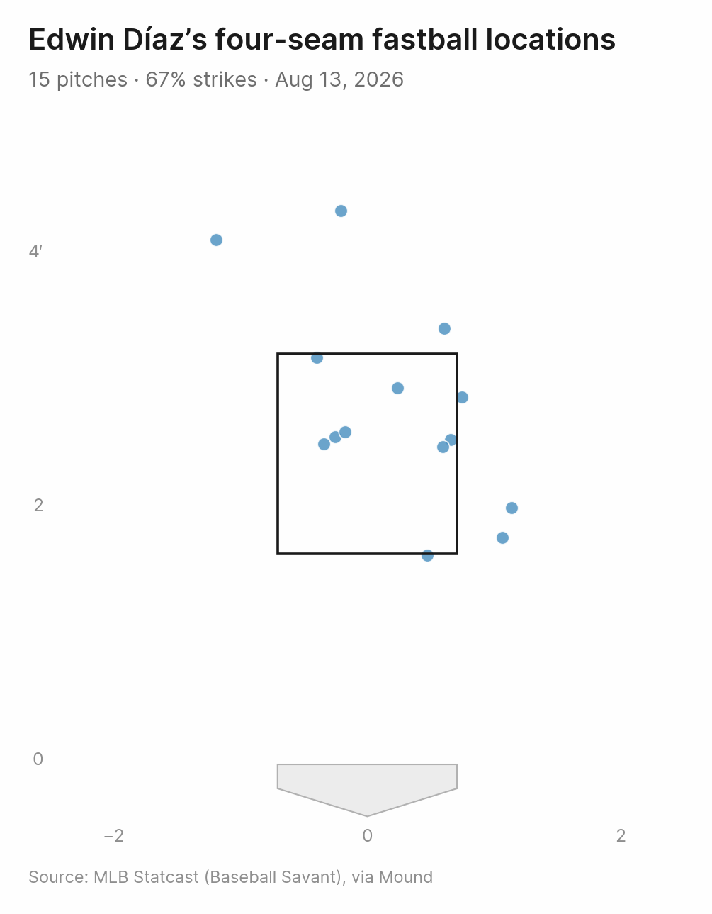
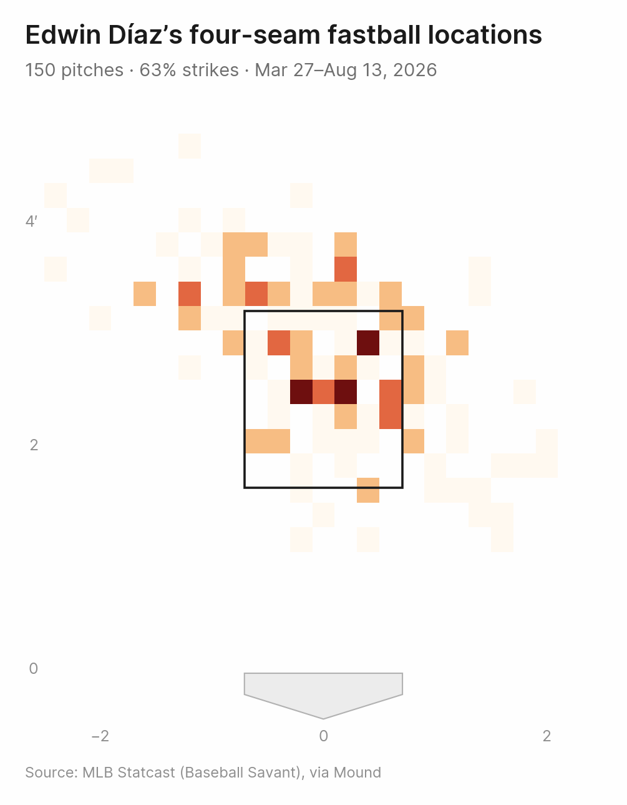
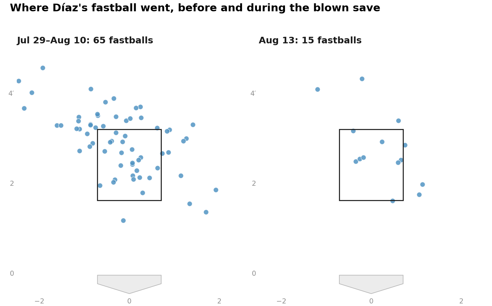

# Did Díaz miss "right in the middle"?

A worked example: taking a pitcher's own explanation for a bad night and checking it against the pitches he actually threw.

Edwin Díaz blew a save for the Dodgers against Milwaukee on Aug. 13, 2026, his third blown save in four appearances. Afterward he said:

> "I was throwing my fastball right in the middle. When you miss in the middle, you pay."

That's a testable claim. This walkthrough goes from a name to an answer in seven steps, using the CLI for the quick looks and Python where the question gets specific. Every command here is runnable as written; `examples/diaz_blown_saves.py` does the whole thing in one script.

## 1. Find the pitcher

Start with the name. `search` returns everyone who matches, which is how you disambiguate — the Stats API knows three Edwin Díazes, and only one of them pitches for Los Angeles.

```bash
mound search "Edwin Diaz"
```

```
621242	Edwin Díaz	Pitcher	Los Angeles Dodgers
641521	Edwin Díaz	Shortstop	Sugar Land Space Cowboys
134262	Edwin Diaz	Second Base	Olmecas de Tabasco
```

Every other command takes the same name (or `621242`, if you'd rather be explicit). Accents are optional in the argument, but Mound will report the name the way MLB does.

## 2. Find the games

"His last four appearances" is a Mound argument, not something you have to look up: `--last 4`. Pull the pitches first, then read the game IDs off the collection.

```python
from mound import Pitcher

diaz = Pitcher("Edwin Díaz")
last4 = diaz.pitches(last=4, cache=True)

print(last4.games)
print(last4.to_frame().groupby(["game_date", "game_pk"]).size())
```

```
[823915, 823918, 825049, 825051]

game_date   game_pk
2026-08-07  825051     17
2026-08-08  825049     24
2026-08-10  823918     12
2026-08-13  823915     24
```

Four appearances, 77 pitches, one inning or less in each — the shape of a closer's workload. The `game_pk` values are MLB's own game IDs, and they're what you pass to `--game` from here on.

One thing the pitch data won't tell you: which of these were saves and which were blown. Saves are a scoring decision, not a Statcast measurement, so that comes from the MLB Stats API game log. For the record: Aug. 7 (blown), Aug. 8 (blown), Aug. 10 (save), Aug. 13 (blown). The same log shows a three-month gap between Apr. 19 and Jul. 29 — the elbow surgery — so these are his fourth through seventh appearances back, not his first four.

## 3. Download every pitch

`--export` writes the full pitch-level table, one row per pitch, with location, velocity, spin, movement, count, batter and outcome.

```bash
mound pitches "Edwin Díaz" --last 4 --cache --export diaz_last4.csv
```

```
77 pitch(es) total.
Exported 77 pitch(es) to diaz_last4.csv
```

`--cache` stores each game's raw Savant response under `~/.cache/mound`, keyed by game ID. Repeat runs only fetch games they haven't seen, which matters here because the rest of this walkthrough queries the same four games a dozen different ways.

> **A note on caching a live game.** A finished game never changes, but a game *in progress* does, so Mound won't cache one — a live game re-fetches on every call and starts being cached once it goes final. Writing this walkthrough is what turned that up: the Aug. 13 game had been cached mid-inning by an earlier version, and `--last 4` quietly returned three games instead of four. Versions before 0.7.1 will still have entries like that on disk; the fix ignores and replaces them on the next run.

Individual games work the same way, which is how you'd pull just the blown save:

```bash
mound pitches "Edwin Díaz" --game 823915 --pitch fastball --cache
```

```
 game_date  inning         pitch_type  velocity      pitch_call at_bat_result
2026-08-13       9 four-seam fastball      97.2   called_strike     Strikeout
2026-08-13       9 four-seam fastball      96.2            ball     Strikeout
2026-08-13       9 four-seam fastball      95.0            ball     Strikeout
2026-08-13       9 four-seam fastball      96.2   called_strike        Single
2026-08-13       9 four-seam fastball      97.6            ball        Single
2026-08-13       9 four-seam fastball      95.9   hit_into_play        Single
2026-08-13       9 four-seam fastball      96.7 swinging_strike        Single
```

## 4. Pitch mix, by game

Díaz throws two pitches, so the mix question is really "how much fastball?"

```bash
mound mix "Edwin Díaz" --last 4 --cache
```

```
four-seam fastball        61.0%
slider                    39.0%
```

`usage_rate()` breaks the same number out by game, which is the version worth looking at — a one-line summary across four outings hides whatever changed between them.

```python
last4.usage_rate(by="game_date").round(1)
```

```
pitch_type  four-seam fastball  slider
game_date
2026-08-07                64.7    35.3
2026-08-08                50.0    50.0
2026-08-10                75.0    25.0
2026-08-13                62.5    37.5
```

Nothing dramatic. He leaned on the slider more in the Aug. 8 blown save and less in the Aug. 10 clean save, but on Aug. 13 he threw his normal mix. Whatever went wrong, it wasn't pitch selection.

## 5. The arsenal: swing, whiff and chase

`mound arsenal` puts stuff and results in one table — velocity, spin and movement on the left, what hitters did with it on the right.

```bash
mound arsenal "Edwin Díaz" --last 4 --cache
```

```
                    pitches  velocity  spin_rate  release_extension  horizontal_break  induced_vertical_break  whiff_rate  chase_rate
pitch_type
four-seam fastball       47      97.0     2337.1                7.2              13.8                    11.7        27.8        25.0
slider                   30      90.3     2283.8                7.0               2.3                     5.3        33.3        45.0
```

Add swing rate — the third angle, and the one that says how often hitters were tempted at all — by composing the pieces yourself:

```python
arsenal = last4.pitch_metrics().round(1)
arsenal["swing_rate"] = last4.swing_rate(by_pitch_type=True).round(1)
arsenal["whiff_rate"] = last4.whiff_rate(by_pitch_type=True).round(1)
arsenal["chase_rate"] = last4.chase_rate(by_pitch_type=True).round(1)
```

```
                    pitches  velocity  ...  swing_rate  whiff_rate  chase_rate
four-seam fastball       47      97.0  ...        38.3        27.8        25.0
slider                   30      90.3  ...        50.0        33.3        45.0
```

The three rates answer different questions and shouldn't be read as one number: swing rate is out of every pitch, whiff rate is out of swings and chase rate is out of pitches *outside* the zone (see [the README](../../README.md#whiff-rate-chase-rate-and-pitch-metrics)). The slider is doing its job — hitters go after it half the time, chase it out of the zone 45% of the time and miss a third of their swings.

Narrow to the blown save and the picture gets stranger:

```bash
mound arsenal "Edwin Díaz" --game 823915 --cache
```

```
                    pitches  velocity  spin_rate  release_extension  horizontal_break  induced_vertical_break  whiff_rate  chase_rate
pitch_type
four-seam fastball       15      96.5     2325.3                7.2              15.1                    12.1        50.0         0.0
slider                    9      90.1     2309.2                6.9               2.1                     5.8        50.0        50.0
```

He missed *more* bats on Aug. 13 than usual: a 50% whiff rate on both pitches, against 27.8% and 33.3% across the four outings. The velocity is there too — 96.5 mph on the night, and 96.7 mph since coming back versus 95.7 mph before the surgery. This wasn't a night where the stuff disappeared, which makes his own explanation more plausible, not less: a pitcher missing bats who still gives up four hits is a pitcher whose mistakes were very hittable.

## 6. Test the quote

"Right in the middle" needs a definition before it can be checked. Two useful ones:

- **Vertically**, the middle third of the strike zone. Mound reports `sz_top` and `sz_bot` per pitch, so the zone is measured against the hitter standing there rather than one fixed height.
- **Horizontally**, the middle third of the plate — `plate_x` within about 0.24 feet of center.

Díaz is a high-fastball pitcher, so the vertical definition is the one that matters: for him, "in the middle" means the ball didn't finish up where it was supposed to.

```python
import pandas as pd

def height_bands(frame):
    f = frame.dropna(subset=["plate_x", "plate_z"]).copy()
    f["height_pct"] = (f["plate_z"] - f["sz_bot"]) / (f["sz_top"] - f["sz_bot"]) * 100
    f["band"] = pd.cut(
        f["height_pct"],
        [-float("inf"), 100 / 3, 200 / 3, float("inf")],
        labels=["low", "middle", "high"],
    ).astype(str)
    f.loc[~f["in_zone"].astype(bool), "band"] = "out of zone"
    return f

season = diaz.pitches(season=2026, cache=True)
season_ff = height_bands(season.to_frame().query("pitch_type == 'four-seam fastball'"))
aug13_ff = season_ff[season_ff["game_date"] == "2026-08-13"]

pd.DataFrame({
    "Aug 13": aug13_ff["band"].value_counts(normalize=True).mul(100),
    "2026 season": season_ff["band"].value_counts(normalize=True).mul(100),
}).round(1)
```

```
             Aug 13  2026 season
band
high           26.7         20.0
low             6.7          8.7
middle         33.3         18.0
out of zone    33.3         53.3
```

He's right. A third of his fastballs on Aug. 13 finished in the middle third of the zone, against 18% for the season. Run the same split across each outing since he came back and only one other night reaches that mark — the Aug. 8 blown save, also 33%; the other five range from 7% to 18%. The other half of the table matters too: he missed out of the zone only 33% of the time, against 53% for the season. His fastball is supposed to be a chase pitch above the zone. On Aug. 13 it was a strike.

The plot says the same thing faster:

```bash
mound zone "Edwin Díaz" --game 823915 --pitch fastball --cache --out diaz_ff_aug13_zone.png
```



Five of the 15 sit at belt height, all of them within the width of the plate and three within four inches of its center. For contrast, here's where the pitch lives across the whole season:

```bash
mound zone "Edwin Díaz" --since 2026-03-01 --pitch fastball --kind heatmap --cache --out diaz_ff_season_heatmap.png
```



### And does he actually pay for it?

The second half of the quote is a separate claim, and it holds up better than the first. Split the season's fastballs by band and look at what hitters did with each:

```python
grouped = season_ff.groupby("band")
pd.DataFrame({
    "pitches": grouped.size(),
    "swing_rate": 100 * grouped["is_swing"].mean(),
    "whiffs": grouped["is_whiff"].sum(),
    "balls_in_play": grouped["pitch_call"].apply(lambda s: (s == "hit_into_play").sum()),
}).round(1)
```

```
             pitches  swing_rate  whiffs  balls_in_play
band
high              30        46.7       4              3
low               13        30.8       0              1
middle            27        70.4       2             10
out of zone       80        26.2       4              5
```

Eighteen percent of his fastballs account for more than half of the contact against them. Hitters swing at the middle-third fastball 70% of the time and almost never miss it — two whiffs all season, against ten balls in play. The pitch up gets swung at less and missed more.

### Which pitches got hit

Line up the balls in play against the same bands and the mechanism is visible one pitch at a time:

```python
contact = height_bands(last4.to_frame())
contact[contact["pitch_call"] == "hit_into_play"]
```

```
 game_date      batter_name         pitch_type  velocity  plate_x  height_pct        band at_bat_result
2026-08-07 Ryan Waldschmidt             slider      90.1     0.02       73.86        high      Home Run
2026-08-08  Geraldo Perdomo four-seam fastball      96.5     0.06       65.13      middle        Triple
2026-08-08   Corbin Carroll four-seam fastball      98.6     0.07       57.21      middle        Triple
2026-08-08   Gabriel Moreno             slider      90.4    -0.10       40.61      middle       Lineout
2026-08-08      Ketel Marte four-seam fastball      95.1     0.26      114.59 out of zone       Pop Out
2026-08-10    Isaac Collins four-seam fastball      97.0     0.20       66.24      middle        Flyout
2026-08-10       Kyle Isbel             slider      90.6     0.31       -8.50 out of zone     Groundout
2026-08-13       Joey Ortiz four-seam fastball      95.9    -0.35       57.39      middle        Single
2026-08-13   David Hamilton four-seam fastball      96.1    -0.18       63.71      middle        Single
2026-08-13  Jackson Chourio             slider      91.1     1.18        2.26 out of zone        Single
2026-08-13 Garrett Mitchell             slider      90.0     0.67       18.84         low        Single
```

Every fastball hit in the three blown saves but one was in the middle band, and the two Arizona triples on Aug. 8 were as close to dead center as the data gets — `plate_x` of 0.06 and 0.07 feet, less than an inch off the middle of the plate.

But the Aug. 13 inning has a wrinkle his quote skips. The two center-cut fastballs were singles that put runners on; the two hits that actually drove in the runs came off sliders, one of them out of the zone entirely and the other at the bottom of it. The middle-middle fastball started the rally. It didn't finish it.

## 7. Watch the pitches

Every pitch carries a `pitch_id`, which doubles as the play ID on a Baseball Savant clip page. If you know the at-bat, you can address a pitch by position: the Hamilton single was the fifth pitch of at-bat 68.

```bash
mound video "Edwin Díaz" --game 823915 --at-bat 68 --pitch-number 5 --cache --out-dir clips
```

```
Saved 1 of 1 clip(s) to clips
```

If you already have the ID from an export, skip the lookup:

```bash
mound video-id a08dfb7d-1acd-3776-a6d8-0f5e80cdb0c6 --out clips/perdomo_triple_aug8.mp4
mound video-id 13f4b8d1-39f4-3499-b696-8a3311899fde --out clips/carroll_triple_aug8.mp4
```

Those two are the Aug. 8 triples — the clearest video evidence of the pattern, since both fastballs were middle-middle at 96 and 98 mph and both ended up in the gap. Whole at-bats work too, by dropping `--pitch-number`; so does an entire outing, though at 24 clips it's a slower download than it looks.

## What the data says

Díaz was right about the fastball, and roughly right about why. He put a third of his four-seamers in the middle third of the zone on Aug. 13, nearly double his season rate, and threw the pitch out of the zone barely more than half as often as usual. That's the pitch he's supposed to elevate finishing flat, and the season splits show it's the one location where hitters do damage against him.

Where the quote oversimplifies: his stuff was fine — 96.5 mph, a 50% whiff rate on both pitches — and the two runs on Aug. 13 scored on sliders, not on the fastballs he was talking about. The honest version is that the middle-middle fastball is what puts runners on base, and with a closer working in the ninth, that's usually enough.

Worth keeping in mind: this is 15 fastballs in one appearance and 150 across the season. Rates built on samples that small move a lot on a pitch or two, and Statcast's `in_zone` is calculated geometry rather than the umpire's call, so the band boundaries here are exact in a way that a real strike zone never is.

## Reproduce it

```bash
python examples/diaz_blown_saves.py
```

Writes the tables above, the location plot and one clip to `examples/output/`.

## Going further

Two windows side by side, using `plot_zone`'s `ax` argument to build a multi-panel figure:

```python
import matplotlib.pyplot as plt

post = diaz.pitches(since="2026-07-29", pitch_type="fastball", cache=True)
before = post.filter(until="2026-08-10")
aug13 = post.filter(since="2026-08-13")

fig, axes = plt.subplots(1, 2, figsize=(9, 5.6))
before.plot_zone(ax=axes[0], title=f"Jul 29–Aug 10: {len(before)} fastballs")
aug13.plot_zone(ax=axes[1], title=f"Aug 13: {len(aug13)} fastballs")
fig.savefig("diaz_ff_panels.png", dpi=150)
```



Other directions from the same data:

- `mound arsenal "Edwin Díaz" --last 4 --stand L` splits the arsenal by batter handedness, or `mound zone --split-by stand` does it visually.
- `diaz.pitches(last=4, batter="Chourio")` scopes any of this to one hitter, for the matchup version of the question.
- `Batter("Jackson Chourio").pitches(last=10)` asks it from the other side: everything that hitter saw, from every pitcher.
