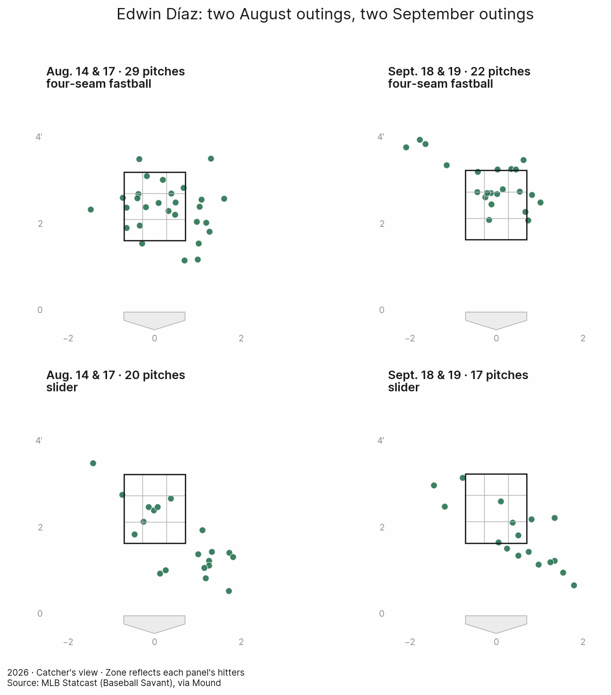

# Is Díaz back? Two outings offer reasons for hope

A slightly harder fastball and more missed bats made Edwin Díaz look sharper against San Francisco. Here's how to check that impression with Mound.

Edwin Díaz struck out four of the eight hitters he faced against San Francisco on Sept. 18 and 19, 2026. He allowed one hit and one walk. After the trouble he had finding outs in August, those two appearances offered something to feel good about.

The hunch was simple: Díaz looked better. Was there something different about his pitches, too?

There was. Compared with two outings in August, his four-seam fastball was about half a mph faster, and hitters missed it on five of 11 swings. In the earlier pair, they missed it once in 12. Across both pitch types, he doubled his whiffs while drawing almost exactly the same number of swings.

That's an encouraging accompaniment to the better results. It isn't enough to declare him back. But it gives us something more useful to watch for next time than whether he gets through the inning.

## Start with the outings you remember

A question like this doesn't need to begin with a season's worth of data. It can start with a few appearances that stuck with you: the ones that were uncomfortable to watch, and the ones that looked more like the pitcher you expected.

For this comparison, those are Aug. 14 against Milwaukee and Aug. 17 at Colorado, followed by the two September appearances against the Giants. These are selected snapshots, not every outing in between or the first two games after an injured-list stint.

| | Aug. 14 & 17 | Sept. 18 & 19 |
| --- | ---: | ---: |
| Batters faced | 14 | 8 |
| Pitches | 49 | 39 |
| Strikeouts | 1 | 4 |
| Hits | 4 | 1 |
| Walks | 2 | 1 |
| Hit batters | 2 | 0 |

The August pair included a double and three singles, plus four hitters who reached on walks or hit-by-pitches. In September, Díaz struck out half the hitters he faced and allowed only two to reach on a hit or walk.

Mound can retrieve those exact games by MLB's game IDs. Keeping the IDs fixed means the example will still compare the same outings a month from now:

```python
from mound import Pitcher

diaz = Pitcher("Edwin Díaz")
august = diaz.pitches(game=[823913, 824320], cache=True)
september = diaz.pitches(game=[823898, 823899], cache=True)
```

Now the question is what changed underneath those results.

## The fastball was harder to hit

The most striking difference wasn't how often Díaz threw his fastball. It accounted for 59% of his pitches in the August pair and 56% in September. His slider made up the rest.

It was what happened when hitters swung at the fastball.

| Four-seam fastball | Aug. 14 & 17 | Sept. 18 & 19 |
| --- | ---: | ---: |
| Pitches | 29 | 22 |
| Average velocity | 96.8 mph | 97.3 mph |
| Swings | 12 | 11 |
| Whiffs | 1 | 5 |
| Whiff rate | 8.3% | 45.5% |

Whiff rate is misses divided by swings. In August, hitters made contact on 11 of their 12 swings at the pitch. In September, they missed nearly half the time.

The extra velocity was modest, but it appeared in both September outings. Díaz averaged 97.6 mph on Sept. 18 and 97.1 the next night, compared with 96.9 against Milwaukee and 96.6 at Colorado.

On Sept. 19, the fastball finished two strikeouts: Shay Whitcomb swung through one at 97.0 mph, and Osleivis Basabe missed one at 97.4. Four of the five September fastball whiffs came that night. It was the stronger of the two outings by that measure, and a large share of the case for optimism.

You can check velocity and whiff rate without building a custom calculation:

```python
for label, pitches in [("August", august), ("September", september)]:
    fastballs = pitches.filter(pitch_type="fastball")
    print(label)
    print(fastballs.pitch_metrics()[["pitches", "velocity"]])
    print("Whiff rate:", fastballs.whiff_rate())
```

A little more speed could have helped. These four games can't tell us how much of the added swing-and-miss came from velocity, location, sequencing or the hitters in the box. What they show is a slightly harder fastball getting better results against swings.

## More misses, with roughly the same mix

Across his fastball and slider, Díaz generated six whiffs on 19 swings in September, up from three on 20 in August. That's a whiff rate of 31.6%, compared with 15.0%.

The gain came from the fastball. The slider produced two misses on eight swings in August and one on eight in September. It did draw an extra chase: hitters swung at three of 11 sliders outside the zone in September, compared with two of 13 before.

Those counts help keep the percentages in perspective. The slider's chase rate rose from 15.4% to 27.3%, but the difference in swings was one. It would be a stretch to call that a transformed pitch.

The overall picture is more promising: Díaz was missing more bats, walking fewer hitters and allowing fewer hits. The two fastball strikeouts on Sept. 19 show how the pitch contributed to those outs. The lower hit and walk totals are encouraging alongside that improvement, though they can't all be credited to another half a mph.

## A closer look at location and movement

The fastballs in September were concentrated higher than in the August pair, while the sliders tended to finish lower and to the right in the catcher's view. The chart lets us inspect that impression pitch by pitch:



Díaz put 16 fastballs inside the strike zone in each pair of games. In September, he did it in 22 pitches rather than 29. He also got more misses. More fastballs in the zone didn't mean more contact in these outings.

There is another apparent improvement worth checking before getting carried away. His fastball's average induced vertical break—a measure of vertical movement with gravity's effect removed—rose from 10.4 inches to 12.9.

But the game-by-game numbers complicate that comparison:

| Outing | Fastball velocity | Induced vertical break |
| --- | ---: | ---: |
| Aug. 14 vs. Milwaukee | 96.9 mph | 12.4 inches |
| Aug. 17 at Colorado | 96.6 mph | 8.5 inches |
| Sept. 18 vs. San Francisco | 97.6 mph | 12.5 inches |
| Sept. 19 vs. San Francisco | 97.1 mph | 13.2 inches |

The Colorado game pulls down August's average. Against Milwaukee, the pitch's vertical break was already much closer to September's. This comparison doesn't adjust for altitude or other differences between outings, so it can't establish that Díaz changed the shape of his fastball.

That's a useful reason to keep individual games visible even when comparing groups. A pooled number can suggest a new question without answering it.

## Something to watch next time

Two better outings are still two better outings. The results improved, the fastball was a little firmer, and it missed more bats. There are reasons to be encouraged beyond the final line.

There are also just 39 September pitches here, against one opponent. The August hitters were different, one game was in Colorado, and the two windows were chosen because they looked different in the first place. This is an exploration of that impression, not an independent test of a turnaround. Nor does it establish a return to Díaz's best form; that would require a broader comparison.

For the next outing, the fastball is worth watching. Is it still around 97 mph? Can he keep throwing it in the zone and getting swings through it? Do the walks stay down as the sample grows?

“Is Díaz back?” will take longer to answer. “Was there something behind those two better appearances?” already has an encouraging answer.

## Reproduce the analysis

The [companion script](../../examples/diaz_two_windows.py) retrieves the four games, prints the comparisons and saves the pitch-level data, summary tables, report and location chart:

```bash
python examples/diaz_two_windows.py
```

Outputs go to `examples/output/diaz_two_windows/`. The script requires access to MLB's Stats API and Baseball Savant and caches completed game feeds in the repository's `cache/` directory. Use `--out-dir` or `--cache-dir` to choose another location.

The games are pinned to these IDs:

| Date | Opponent | Venue | Game ID |
| --- | --- | --- | ---: |
| Aug. 14, 2026 | Milwaukee Brewers | Home | 823913 |
| Aug. 17, 2026 | Colorado Rockies | Away | 824320 |
| Sept. 18, 2026 | San Francisco Giants | Home | 823898 |
| Sept. 19, 2026 | San Francisco Giants | Home | 823899 |

The script includes counts beside whiff and chase rates and preserves missing tracking values as unknown. Plate-appearance results come from the final pitch of each at-bat, using `ends_at_bat`; the output is not an official innings, runs or saves line. Zone membership is based on measured pitch location and the hitter's recorded strike zone, not the umpire's call.

For a quick look at either September outing from the terminal:

```bash
mound arsenal "Edwin Díaz" --game 823898 --cache
mound arsenal "Edwin Díaz" --game 823899 --cache
```

The same workflow applies to another hunch: choose the outings, compare the pitches and their results, then look at the games individually before deciding what the averages mean.
