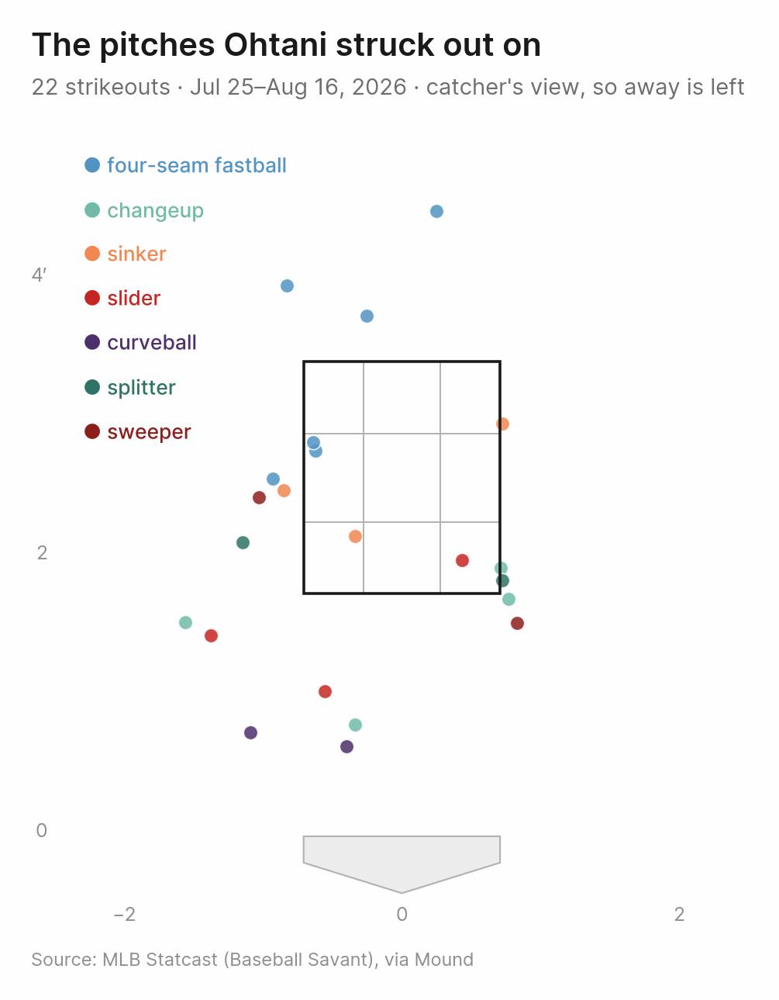
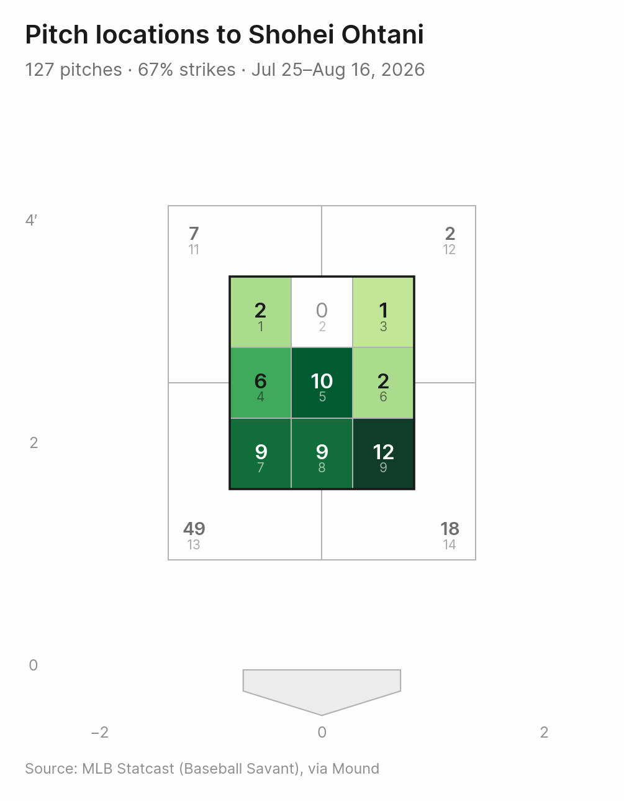
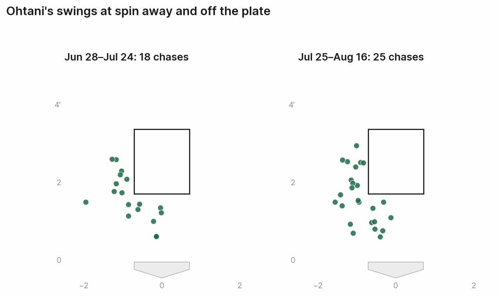

# Is Ohtani chasing spin away?

A worked example from the hitter's side: taking a hunch off the couch and testing it against every pitch he saw.

Watching the Dodgers in the middle of August 2026, Shohei Ohtani looked like he was striking out on the same pitch over and over — a slider or a changeup down and away, off the plate, swung at anyway. Stated plainly, the hunch is:

> He's been striking out a lot lately by chasing sliders and changeups away.

Three claims are hiding in there: that he's striking out more than usual, that the strikeouts come on breaking and offspeed pitches, and that he's swinging at them rather than taking them. Each one is checkable, and they don't all survive.

This walkthrough goes from a hitter's name to an answer in seven steps. The Díaz example runs mostly through the CLI; this one is Python, because the CLI takes a pitcher as its subject and reaches hitters only as a filter (`--batter`). A hitter-first CLI is on the [roadmap](../../ROADMAP.md). `examples/shohei_spin_chase.py` does the whole thing in one script.

## 1. Start from the hitter

`Batter` is the mirror of `Pitcher`: `pitches()` returns the pitches this hitter *faced*, pulled from the games he played.

```python
from mound import Batter

ohtani = Batter("Shohei Ohtani")
faced = ohtani.pitches(last=40, cache=True)

print(faced)
print(len(faced.games), "games,", faced.to_frame().game_date.min(), "to", faced.to_frame().game_date.max())
```

```
<PitchCollection to Shohei Ohtani: 617 pitches>
40 games, 2026-06-28 to 2026-08-16
```

Two things about that call. `last=40` rather than `last=20`, because "he's striking out a lot" is a comparison and needs something to compare against; the second half of this is the recent 20 games, the first half is the 20 before them. And `cache=True`, because the hitter's side is expensive: one Savant game feed per game he played, where asking from a starter's side would be one per start. Forty games is forty requests on a cold cache and none on a warm one.

## 2. What the last 20 games look like

Savant stamps an at-bat's result on every pitch of that at-bat, so counting `at_bat_result` straight from the frame counts a six-pitch strikeout six times. `ends_at_bat` keeps the one pitch each at-bat finished on, which makes one row per plate appearance.

```python
recent = faced.filter(since="2026-07-25")
plate_appearances = recent.filter(ends_at_bat=True)

print(recent, "\n")
print(plate_appearances.to_frame().at_bat_result.value_counts().head(8))
```

```
<PitchCollection to Shohei Ohtani: 308 pitches>

at_bat_result
Strikeout    22
Groundout    14
Single       12
Flyout       11
Double        6
Home Run      5
Walk          4
Lineout       3
```

Twenty-two strikeouts in 84 plate appearances, a 26.2% strikeout rate. On its own that number settles nothing: 84 plate appearances is three weeks of baseball, and a rate built on that moves several points on two or three swings. Step 6 puts it next to the previous three weeks, which is the only comparison here that comes from the same data.

## 3. Which pitch ended each strikeout

The strikeouts are the rows where `at_bat_result` says so, and `pitch_call` says how each one ended.

```python
ends = plate_appearances.to_frame()
strikeouts = ends[ends.at_bat_result.str.contains("Strikeout", na=False)]

print(len(strikeouts), "strikeouts in", len(ends), "plate appearances")
print(strikeouts.pitch_call.value_counts())
```

```
22 strikeouts in 84 plate appearances
pitch_call
swinging_strike            11
called_strike               5
foul_tip                    4
swinging_strike_blocked     2
```

Seventeen of the 22 ended on a swing: 11 clean swinging strikes, two on a pitch the catcher blocked, four on a foul tip (a swing that nicks the ball into the mitt, strike three either way). Five were called. That much matches the hunch — this isn't a hitter getting rung up on the corner.

Now the whole list, sorted by pitch type and location:

```python
print(
    strikeouts[["game_date", "pitcher_name", "pitch_type", "velocity", "plate_x", "zone", "pitch_call"]]
    .sort_values(["pitch_type", "plate_x"])
    .to_string(index=False)
)
```

```
 game_date      pitcher_name         pitch_type  velocity   plate_x  zone              pitch_call
2026-08-16   Logan Henderson           changeup      83.0 -1.561891    13         swinging_strike
2026-08-08    Brandon Pfaadt           changeup      87.3 -0.336024    13         swinging_strike
2026-08-08 Jonathan Loáisiga           changeup      91.3  0.711303     9                foul_tip
2026-08-09 Eduardo Rodriguez           changeup      83.7  0.769090     9         swinging_strike
2026-08-01      Payton Tolle          curveball      83.6 -1.090767    13 swinging_strike_blocked
2026-07-26    Freddy Peralta          curveball      81.0 -0.401860    13 swinging_strike_blocked
2026-07-31     Ranger Suarez four-seam fastball      92.5 -0.931800    13           called_strike
2026-07-29   Emerson Hancock four-seam fastball      96.4 -0.827378    11         swinging_strike
2026-08-11     Michael Wacha four-seam fastball      96.1 -0.641896     4                foul_tip
2026-08-09 Eduardo Rodriguez four-seam fastball      93.1 -0.620316     4           called_strike
2026-08-11      Nate Pearson four-seam fastball      99.4 -0.255746    11                foul_tip
2026-07-26    Freddy Peralta four-seam fastball      94.1  0.250234    12                foul_tip
2026-08-02      Jake Bennett             sinker      91.8 -0.849577    13           called_strike
2026-08-12   Daniel Lynch IV             sinker      93.6 -0.338815     7           called_strike
2026-07-25      Nolan McLean             sinker      95.6  0.727043     3           called_strike
2026-08-13      Shane Drohan             slider      88.1 -1.375032    13         swinging_strike
2026-08-15       Aaron Ashby             slider      85.3 -0.553687    13         swinging_strike
2026-08-15 Jacob Misiorowski             slider      92.5  0.431444     9         swinging_strike
2026-08-02    Tyron Guerrero           splitter      92.2 -1.148694    13         swinging_strike
2026-08-05     Shota Imanaga           splitter      81.8  0.724318     9         swinging_strike
2026-08-14     Robert Gasser            sweeper      82.2 -1.029389    13         swinging_strike
2026-08-05    Tyler Ferguson            sweeper      85.6  0.830847    14         swinging_strike
```

Twenty pitchers for 22 strikeouts, with only Freddy Peralta and Eduardo Rodriguez appearing twice, so this isn't one arm's report card. Six of the 22 were four-seam fastballs, and five of those six were called strikes or foul tips: the fastball is finishing at-bats without being swung through. Thirteen were breaking or offspeed pitches, and he swung at all 13.

One column carries most of the answer. `zone` is Statcast's numbering as it appears on Savant: 1-9 across the strike zone, 11-14 for the quadrants outside it.

```python
print(strikeouts.zone.value_counts().sort_index())
```

```
zone
3      1
4      2
7      1
9      4
11     2
12     1
13    10
14     1
```

Ten of 22 strikeouts ended in zone 13 alone — one quadrant, the low one on the negative-`plate_x` side. Fourteen were outside the strike zone entirely.

```python
from mound import PitchCollection

PitchCollection(
    [p for p in plate_appearances if "Strikeout" in (p.at_bat_result or "")],
    batter=ohtani.player,
).plot_zone(
    grid=True,
    title="The pitches Ohtani struck out on",
    subtitle="22 strikeouts · Jul 25–Aug 16, 2026 · catcher's view, so away is left",
    out="ohtani_strikeout_pitches.png",
)
```



`grid=True` draws the 3x3 lines inside the zone, which is what makes the cluster below and to the left legible as a place rather than a smear. The fastballs are the three points above the zone and the two in the left-hand column inside it. Everything with spin on it sits low, or off the plate to the left, or both.

## 4. Which side of the plate is that?

Down is unambiguous. Left is not. `plate_x` is signed, and nothing in the feed says which sign is the outer half — that depends on which box the hitter stands in, and Ohtani hits left-handed.

The data settles it without a diagram. Ohtani also pitches, and a pitch that hits a batter is on that batter's side of the plate by definition:

```python
from mound import Pitcher

thrown = Pitcher("Shohei Ohtani").pitches(season=2026, cache=True)
hit_batters = thrown.to_frame().query("pitch_call == 'hit_by_pitch'")

print(hit_batters[["game_date", "batter_name", "batter_stand", "plate_x"]].to_string(index=False))
```

```
 game_date     batter_name batter_stand   plate_x
2026-03-31  Angel Martínez            L  2.124459
2026-04-28 Agustín Ramírez            R -1.806913
2026-05-05   Isaac Paredes            R -1.318835
2026-05-27  Hunter Goodman            R -2.904604
2026-06-10  Bryan Reynolds            L  2.113268
2026-06-17      Yandy Díaz            R -2.286874
```

He hit two lefties, at `plate_x` of +2.12 and +2.11, and four righties between -1.32 and -2.90. So a left-handed hitter's body is on the positive side, and for Ohtani at the plate, away is negative. In Statcast's numbering that's zones 1, 4 and 7 inside the strike zone and 11 and 13 outside it, with 13 the low one.

That makes zone 13 the pitch the hunch described: away, below the zone, off the plate. Ten of the 22 strikeouts ended there.

## 5. Is he chasing it, or is it just where they throw?

Location alone can't tell those apart. Chase rate can: swings divided by pitches *outside* the zone. Split it by which family the pitch belongs to and which side of the plate it went to.

```python
SPIN = ["slider", "sweeper", "slurve", "curveball", "knuckle curve", "changeup", "splitter"]

off_plate = recent.filter(in_zone=False).to_frame()
off_plate["family"] = off_plate.pitch_type.isin(SPIN).map({True: "spin", False: "fastball"})
off_plate["side"] = off_plate.plate_x.map(lambda x: "away" if x < 0 else "in")

splits = off_plate.groupby(["family", "side"]).agg(
    pitches=("is_swing", "size"), swings=("is_swing", "sum")
)
splits["chase_rate"] = (100 * splits.swings / splits.pitches).round(1)
print(splits)
```

```
               pitches  swings  chase_rate
family   side
fastball away       53      11        20.8
         in         36      16        44.4
spin     away       56      25        44.6
         in         20      10        50.0
```

Away and off the plate, he lets 79% of the fastballs go and swings at 45% of the spin. Same side, same not-a-strike, twice the swings. That gap is the finding: it isn't that he's swinging at everything, and it isn't that pitchers found a new place to throw. It's that anything that breaks gets a swing out there and anything straight doesn't.

Per pitch type, over the same 20 games:

```python
print(recent.chase_rate(by_pitch_type=True).round(1))
```

```
pitch_type
splitter              100.0
sweeper                54.5
slider                 52.6
cutter                 46.7
changeup               41.4
curveball              37.5
four-seam fastball     32.7
sinker                 13.6
```

Sweepers and sliders out of the zone get swung at more than half the time. The splitter's 100% is one pitch, thrown once outside the zone and swung at; a rate on a denominator of one is a coin that came up heads. Whiff rates tell the second half of it — changeups 46.4% and curveballs 46.2%, against 25.0% on four-seamers — so the swings out there are also the swings that miss.

Where do pitchers put spin against him? `kind="zones"` counts it into the same numbering:

```python
recent.filter(pitch_type=SPIN).plot_zone(kind="zones", out="ohtani_spin_zones.png")
```



Forty-nine of 127 breaking and offspeed pitches went to zone 13, more than the other three outside quadrants combined and more than the whole bottom row of the strike zone. That's the plan, and it isn't new: the previous 20 games put 50 pitches in the same cell. What changed is what he did about them.

## 6. Is any of this new?

The same summary, run over each half of the 40 games. Filtering to zones 11 and 13 is the same thing as away-and-off-the-plate, now that step 4 has settled which side is which.

```python
import pandas as pd

prior = faced.filter(until="2026-07-24")

def summarize(window):
    frame = window.to_frame()
    ends = frame[frame.ends_at_bat == True]
    strikeouts = ends[ends.at_bat_result.str.contains("Strikeout", na=False)]
    chased = window.filter(pitch_type=SPIN, zone=[11, 13]).to_frame()
    return {
        "plate appearances": len(ends),
        "strikeouts": len(strikeouts),
        "strikeout rate": round(100 * len(strikeouts) / len(ends), 1),
        "spin away, off the plate": len(chased),
        "swung at": int(chased.is_swing.sum()),
        "chase rate there": round(100 * chased.is_swing.mean(), 1),
        "strikeouts ending there": int(strikeouts.zone.isin([11, 13]).sum()),
    }

print(pd.DataFrame({"Jun 28-Jul 24": summarize(prior), "Jul 25-Aug 16": summarize(recent)}))
```

```
                          Jun 28-Jul 24  Jul 25-Aug 16
plate appearances                  87.0           84.0
strikeouts                         20.0           22.0
strikeout rate                     23.0           26.2
spin away, off the plate           63.0           56.0
swung at                           18.0           25.0
chase rate there                   28.6           44.6
strikeouts ending there             4.0           12.0
```

The strikeout rate barely moved: 23.0% to 26.2%, two extra strikeouts in three fewer plate appearances. That part of the hunch is noise — Fisher's exact test on 20-of-87 against 22-of-84 gives p = 0.72, which is another way of saying two strikeouts.

What moved is where they came from. Pitchers threw *fewer* pitches to that spot, 56 against 63, and he swung at seven more of them, so the chase rate there went from 28.6% to 44.6%. Strikeouts that ended out there went from 4 to 12. In the earlier window he was also striking out swinging — 15 of 20 ended on a swing, against 17 of 22 — but on pitches spread around the zone instead of piled into one quadrant.

```python
prior_ends = prior.filter(ends_at_bat=True).to_frame()
prior_strikeouts = prior_ends[prior_ends.at_bat_result.str.contains("Strikeout", na=False)]

print(prior_strikeouts.pitch_call.value_counts())
```

```
pitch_call
swinging_strike            12
called_strike               5
swinging_strike_blocked     3
```

The two sets of chases, side by side, using `plot_zone`'s `ax` argument to put them in one figure:

```python
import matplotlib.pyplot as plt
from mound.viz import MOUND_STYLE

with plt.rc_context(MOUND_STYLE):
    fig, axes = plt.subplots(1, 2, figsize=(9, 5.6))
    for ax, (label, window) in zip(axes, (("Jun 28–Jul 24", prior), ("Jul 25–Aug 16", recent))):
        chased = PitchCollection(
            [p for p in window.filter(zone=[11, 13], pitch_type=SPIN) if p.is_swing],
            batter=ohtani.player,
        )
        chased.plot_zone(ax=ax, color_by=None, title=f"{label}: {len(chased)} chases")
    fig.savefig("ohtani_chase_panels.png", dpi=150, bbox_inches="tight")
```



`color_by=None` drops the pitch-type colors, so the comparison is about how many points there are and where they sit rather than which pitch each one was.

Be honest about the size of it. Twenty-five swings out of 56 against 18 out of 63 is a 16-point difference with a 95% confidence interval running from roughly -1 to +33 points (Fisher's exact p = 0.086). Suggestive, not established. The part that's harder to shrug off is the composition: 12 strikeouts ending in two quadrants where there had been 4.

## 7. Watch them

Each pitch's `pitch_id` is also its play ID on a Savant clip page, so the eight spin-away strikeouts can be pulled as video.

```python
chase_strikeouts = strikeouts[strikeouts.zone.isin([11, 13]) & strikeouts.pitch_type.isin(SPIN)]
print(chase_strikeouts[["game_date", "pitcher_name", "pitch_type", "velocity", "pitch_id"]].to_string(index=False))
```

```
 game_date    pitcher_name pitch_type  velocity                             pitch_id
2026-07-26  Freddy Peralta  curveball      81.0 99f88a82-2f81-3a25-9009-9c94bed06962
2026-08-01    Payton Tolle  curveball      83.6 8c78b3c5-91ef-325b-8eda-2b712e69bf7d
2026-08-02  Tyron Guerrero   splitter      92.2 a175f599-bc2c-349d-a23b-c9773e01f5f0
2026-08-08  Brandon Pfaadt   changeup      87.3 1b3d5c35-05f6-33a9-b56d-e0f19af7b8ae
2026-08-13    Shane Drohan     slider      88.1 9361b788-e90d-3fbb-9803-a0e6d19fb43b
2026-08-14   Robert Gasser    sweeper      82.2 fbcca9dc-d705-3c94-85d6-b25e8c224ef4
2026-08-15     Aaron Ashby     slider      85.3 5f3800cb-e843-35a9-a497-4d8d55d92330
2026-08-16 Logan Henderson   changeup      83.0 c35be0c6-07e9-3ab3-9c9d-ca15b4dc42ca
```

```bash
mound video-id 9361b788-e90d-3fbb-9803-a0e6d19fb43b --out clips/drohan_slider_aug13.mp4
mound video-id fbcca9dc-d705-3c94-85d6-b25e8c224ef4 --out clips/gasser_sweeper_aug14.mp4
```

```
Saved clip to clips/drohan_slider_aug13.mp4
Saved clip to clips/gasser_sweeper_aug14.mp4
```

The Aug. 16 changeup is a separate kind of miss: that game had finished an hour before this was written, and Savant hadn't posted its video yet. `VideoNotFoundError` covers both a pitch too old for Savant's coverage and one too new.

### One video instead of 21 files

Twenty-two clips opened one at a time is a worse way to watch a pattern than one file that plays straight through. Here are the strikeouts on spin away, back to back, each labeled with the pitch it ended on — seven of the eight, since the Aug. 16 changeup has no clip:

[](https://www.youtube.com/watch?v=N4QMdEfN15M)

Watching them in a row is the part a table can't do, though the numbers behind the seven point the same way. All of them crossed off the plate on the outer half, and five crossed below his knees: in inches off the ground, 7, 8, 9, 12, 17, 25 and 29, against a `sz_bot` of 1.7 feet. The two lowest are both curveballs, from Freddy Peralta and Payton Tolle, and both are recorded as `swinging_strike_blocked` — down far enough that the catcher blocked the pitch rather than caught it.

`examples/shohei_strikeout_supercut.py` builds it: a clip per strikeout, the pitch written onto each one, joined in order.

```bash
python examples/shohei_strikeout_supercut.py              # all 22
python examples/shohei_strikeout_supercut.py --spin-away  # just the chases, as above
```

```
22 strikeouts, Jul 25–Aug 16. Fetching clips:
  no clip: Aug 16 Logan Henderson -- No broadcast clip found for pitch_id='c35be0c6-07e9-3ab3-9c9d-ca15b4dc42ca'
  21 of 22 clips available
  labeling 1/21: Nolan McLean, sinker
  ...
Saved 21 clips as one video: examples/output/ohtani_strikeouts.mp4
```

That one runs two and a half minutes: [all 21 strikeouts, in the order they happened](https://www.youtube.com/watch?v=0JUvfzH4aho). The label on each clip carries the pitcher, the pitch type in the color the charts give it, the velocity, the zone and how it ended. The card sits bottom-left because MLB broadcasts put their score bug bottom-right; the clip counter goes inside the card rather than in a corner, since which corner holds the network logo changes from broadcast to broadcast.

Watched end to end, it sharpens the split from step 3. The nine strikeouts that ended on a fastball or a sinker were decisions more than misses — eight of the nine were called strikes or foul tips, and their zones are spread around the edges without piling anywhere. All 13 that ended on something with spin were swings, and every one of them crossed below the middle of the zone: eight off the plate away in zone 13, four in the bottom-inside corner, one below the zone and inside.

Mound does the data and the downloads; the stitching is [ffmpeg](https://ffmpeg.org), which the script expects on `PATH`. Every clip is re-encoded on the way in, because Savant's clips share a resolution but not a frame rate — some 60, some 120 — and the concat demuxer needs its inputs to agree. Clips are cached in `examples/output/clips/` and reused, so a second run only re-stitches. Nothing from that directory is committed to the repo.

## What the data says

The hunch is two-thirds right, and the third that's wrong is the part it led with.

He is not striking out much more than he was: 26.2% against 23.0%, a difference of two strikeouts. But the strikeouts have moved. Twelve of 22 ended on a pitch away and off the plate, against 4 of 20 in the previous three weeks, and 10 of them landed in one quadrant — zone 13, low and away. Seventeen of the 22 ended on a swing.

The mechanism is a swing decision, not a location. Pitchers put spin in that quadrant just as often before, 50 pitches to 49. His chase rate on spin away and off the plate went from 28.6% to 44.6%, while his chase rate on fastballs in the same place stayed at 20.8%. He is picking up the straight ball out there and swinging at the one that breaks.

What this can't tell you is why. Nothing here separates a timing problem from a swing change from a pitch he's newly guessing on, and 56 pitches is 56 pitches — the chase difference alone would not clear a significance test (p = 0.086). What the data supports is a narrower claim than the hunch: the strikeouts have concentrated in one quadrant, on one kind of pitch, and he's swinging at it.

## Reproduce it

```bash
python examples/shohei_spin_chase.py           # the tables and the plots
python examples/shohei_strikeout_supercut.py   # the strikeouts as one video
```

Both write to `examples/output/`. The second one needs ffmpeg.

## Going further

Which arms did it, and whether any of them did it twice:

```python
chase_strikeouts.pitcher_name.value_counts()
```

Eight strikeouts, eight pitchers, so from the hitter's side this is a league-wide plan rather than a matchup. To study one arm's version of it, ask from the pitcher's side instead — it's the same pitches from a fraction of the fetches, since a starter appears in a handful of the games a hitter plays:

```python
from mound import Pitcher

Pitcher("Robert Gasser").pitches(season=2026, batter="ohtani", cache=True)
```

Other directions from the same 40 games:

- `recent.filter(zone=13).swing_rate()` against `prior.filter(zone=13).swing_rate()` asks the swing-decision question without the pitch-type split.
- `recent.filter(pitch_type=SPIN, zone=[11, 13]).plot_zone(kind="kde")` smooths the chase cloud, if 56 points is enough for a shape (it's borderline).
- Swing decisions by count — ahead, behind, two strikes — would separate a chase from a protect-the-plate swing. Mound has `balls` and `strikes` on every pitch; the plate-discipline framing on top of them is a [roadmap](../../ROADMAP.md) item, not a built-in.
